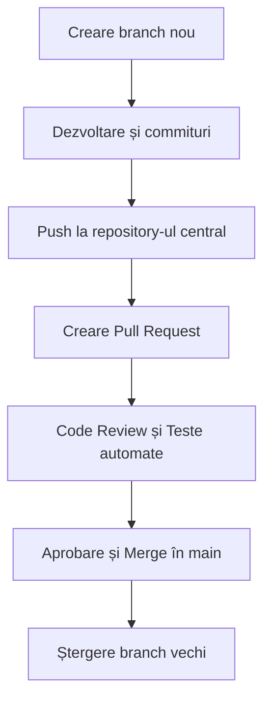

# 🌿 Fluxul de lucru Git Feature Branch Workflow

## 🔹 Ce este Git Feature Branch Workflow?

**Git Feature Branch Workflow** este o metodă de lucru în Git care implică **crearea unei ramuri (branch)** separate pentru fiecare funcționalitate, corecție de eroare sau experiment.  
Aceasta permite dezvoltatorilor să lucreze **izolat**, fără a afecta ramura principală (*main* sau *master*).  

După finalizarea lucrului, modificările sunt integrate în ramura principală printr-un **Pull Request (PR)**, care este apoi revizuit și aprobat de alți membri ai echipei.

> Pe scurt, fiecare funcționalitate are propria sa ramură, ceea ce oferă un flux de lucru clar, sigur și colaborativ.

---

## ⚙️ Avantajele Feature Branch Workflow

- 🔒 **Izolare totală** a modificărilor – codul experimental nu afectează aplicația stabilă.  
- 🧩 **Colaborare ușoară** – fiecare dezvoltator lucrează pe propria ramură.  
- 🔄 **Istoric clar al modificărilor** – fiecare branch are un scop specific.  
- 🧪 **Testare înainte de integrare** – codul este verificat prin PR și teste automate.  
- 🚀 **Livrare mai sigură** – doar codul validat ajunge în ramura principală.  

---

## 🌱 Working in Branches – Lucrul în ramuri

### 1. Creează o nouă ramură pentru o funcționalitate
De obicei, ramurile au un nume descriptiv, cum ar fi `feature/nume-functie` sau `bugfix/id-eroare`.

```bash
git checkout -b feature/autentificare-utilizator
```

Această comandă:
- creează o nouă ramură numită `feature/autentificare-utilizator`,  
- comută automat pe acea ramură.

---

### 2. Lucrează la cod și salvează modificările
Adaugă, modifică și testează fișierele local.  
Apoi marchează modificările cu un *commit* clar și descriptiv:

```bash
git add .
git commit -m "Adăugat sistem de autentificare utilizator"
```

Recomandare: folosește mesaje scurte și semnificative, ușor de urmărit în istoric.

---

### 3. Publică ramura pe repository-ul central

După ce ai terminat de lucrat local, trimite ramura către serverul Git (ex: GitHub, GitLab, Bitbucket):

```bash
git push origin feature/autentificare-utilizator
```

> Acum, ceilalți membri ai echipei pot vedea codul tău și pot contribui sau comenta.

---

## 🔁 Making a Pull Request – Crearea unui Pull Request

### 1. Deschide un Pull Request (PR)
După ce ramura ta este împinsă (push), mergi pe platforma GitHub/GitLab și creează un **Pull Request**:

- Selectează ramura de bază (*main/master*) și ramura de funcționalitate.  
- Adaugă un titlu clar și o descriere a modificărilor.  
- Menționează orice probleme rezolvate (ex: `Fixes #12`).

> Un PR comunică echipei: „Am terminat funcționalitatea și vreau ca modificările să fie revizuite și integrate.”

---

### 2. Revizuirea codului (Code Review)
Colegi de echipă analizează codul propus: verifică claritatea, eficiența și compatibilitatea.  
Pot adăuga comentarii și sugestii de îmbunătățire.

> Acest pas ajută la menținerea calității și consistenței codului între toți membrii echipei.

---

### 3. Testare automată și validare
Pipeline-ul CI/CD este declanșat automat:
- rulează testele unitare și de integrare,  
- verifică stilul de cod și securitatea,  
- validează că totul funcționează corect.

Doar dacă toate testele trec, PR-ul poate fi aprobat pentru merge.

---

### 4. Aprobare și integrare (Merge)
După aprobarea PR-ului, ramura este integrată în ramura principală prin comanda:

```bash
git merge feature/autentificare-utilizator
```

După integrare, ramura poate fi ștearsă pentru a menține repository-ul curat:

```bash
git branch -d feature/autentificare-utilizator
git push origin --delete feature/autentificare-utilizator
```

---

## 🧭 Pe scurt – Fluxul complet



> **Rezumat:**  
> - Fiecare funcționalitate = o ramură dedicată.  
> - Fiecare ramură = un PR pentru revizuire și integrare sigură.  
> - Rezultat = cod curat, istoric clar și colaborare eficientă.

---

## 🧠 Recomandări bune de practică

- Creează ramuri scurte și specifice.  
- Fă commituri clare și frecvente.  
- Revizuiește PR-urile altor colegi.  
- Nu amâna integrarea ramurilor pentru a evita conflicte mari.  
- Folosește automatizare (CI/CD) pentru testare și validare.  

---

## 🧩 Beneficiile Git Feature Branch Workflow

- 🔄 Flux clar și ușor de urmat.  
- 🧱 Cod izolat și sigur în timpul dezvoltării.  
- 🧪 Testare automată integrată în pipeline.  
- 🧩 Colaborare ușoară între echipe.  
- 📜 Istoric curat și organizat în repository.  

---