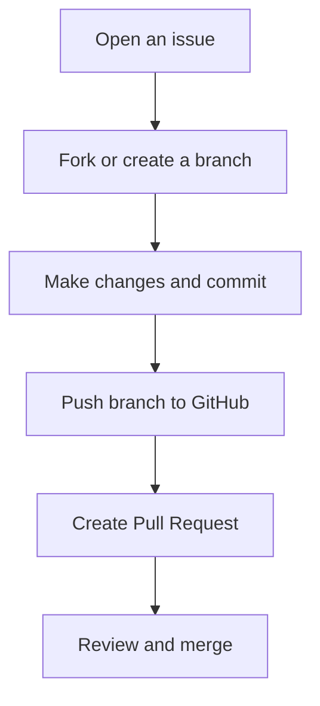

# 🐙 GitHub – Ghid de Început

## 🔹 Ce este GitHub?

**GitHub** este o platformă de găzduire și colaborare pentru proiecte software, bazată pe sistemul de control al versiunilor **Git**.  
Permite dezvoltatorilor să lucreze împreună la același cod, să urmărească modificările și să integreze contribuții din întreaga lume.

> Git = controlul versiunilor  
> GitHub = platforma colaborativă bazată pe Git

---

## ⚙️ De ce să folosești GitHub?

- 🌍 Colaborare globală între dezvoltatori.  
- 🧩 Urmărirea și gestionarea versiunilor codului.  
- 💬 Discuții și feedback prin *issues* și *pull requests*.  
- 🧪 Integrare cu instrumente CI/CD (ex: GitHub Actions).  
- 📂 Găzduirea sigură a codului și a documentației.  

---

## 🧰 Noțiuni de bază în GitHub

| Concept | Descriere |
|----------|------------|
| **Repository (repo)** | Un spațiu unde se stochează codul și istoricul modificărilor. |
| **Branch** | O ramură separată a codului, folosită pentru a dezvolta funcționalități fără a afecta ramura principală. |
| **Commit** | O salvare a schimbărilor în cod, cu un mesaj descriptiv. |
| **Pull Request (PR)** | O cerere de integrare a modificărilor într-un alt branch (de obicei în `main`). |
| **Merge** | Procesul prin care se combină modificările dintr-o ramură în alta. |
| **Issue** | O metodă de a semnala probleme, sugestii sau funcționalități noi. |

---

## 🚀 Crearea unui Repository nou

1. Autentifică-te în [GitHub](https://github.com).  
2. Fă clic pe **New Repository**.  
3. Completează detaliile:
   - *Repository name*: numele proiectului (ex: `my-first-repo`)  
   - *Description*: descrierea proiectului  
   - *Visibility*: public sau privat  
4. Adaugă opțional un fișier **README.md** sau **.gitignore**.  
5. Apasă **Create repository**.

---

## 🌿 Lucrul cu Git și GitHub

### 1. Clonează repository-ul pe calculatorul tău
```bash
git clone https://github.com/numele-tau/my-first-repo.git
```

### 2. Creează un branch nou
```bash
git checkout -b feature/noua-functie
```

### 3. Adaugă modificări și salvează-le
```bash
git add .
git commit -m "Adăugat o nouă funcționalitate"
```

### 4. Trimite modificările către GitHub
```bash
git push origin feature/noua-functie
```

### 5. Creează un Pull Request (PR)
- Mergi în pagina repository-ului tău pe GitHub.  
- Vei vedea un mesaj care îți permite să **deschizi un Pull Request**.  
- Adaugă un titlu și o descriere clară a modificărilor.  
- Trimite PR-ul pentru revizuire.

---

## 💬 Flux tipic de colaborare



> Acesta este fluxul standard de lucru în GitHub – folosit în toate echipele DevOps.

---

## ⚙️ GitHub Actions (CI/CD)

GitHub include o secțiune numită **Actions**, care permite automatizarea proceselor de build, testare și livrare (CI/CD).  
Pașii principali sunt definiți într-un fișier YAML din folderul `.github/workflows/`.

Exemplu simplu:

```yaml
name: CI Workflow

on: [push, pull_request]

jobs:
  build:
    runs-on: ubuntu-latest
    steps:
      - name: Checkout code
        uses: actions/checkout@v3
      - name: Run tests
        run: pytest
```

---

## 🧠 Sfaturi pentru începători

- Scrie **mesaje de commit clare**.  
- Creează **branch-uri separate** pentru fiecare funcționalitate.  
- Folosește **issues** pentru a documenta bug-uri sau idei noi.  
- Fă **pull request-uri mici și frecvente** – sunt mai ușor de revizuit.  
- Participă la proiecte open-source pentru a învăța din practică.  

---

## 🧭 Pe scurt

> **GitHub** este locul unde dezvoltatorii colaborează, învață și inovează.  
> Cu ajutorul Git și al unui flux clar de lucru, poți contribui la orice proiect, oriunde în lume.

---